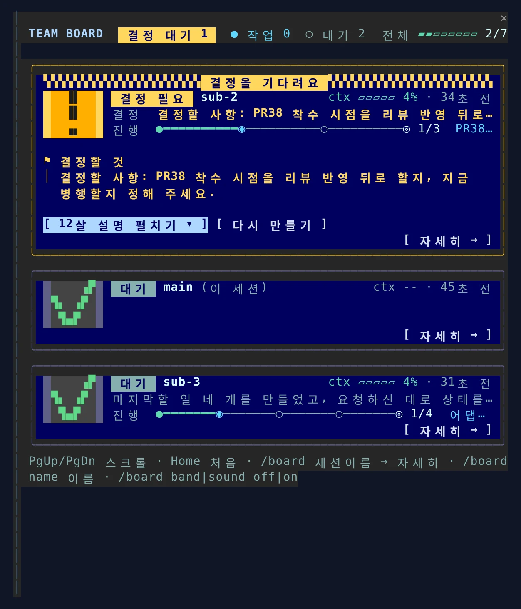
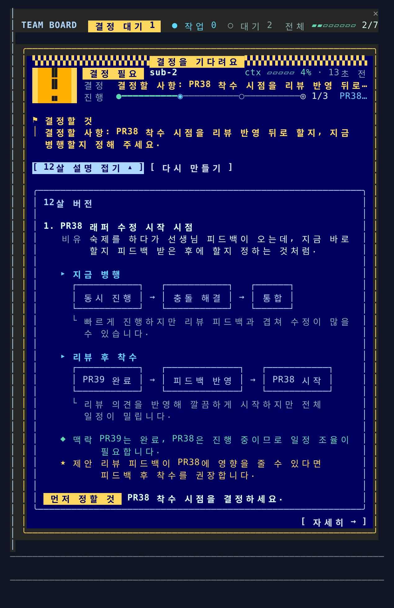

# yeocheol-mods

Claude Code **mods** 모음: 어려운 설명을 12살 버전으로 풀어 주는 `eli12`, 여러 세션을 한눈에 보는 팀 상황판 `team-board`.

<p align="center">
  
</p>

| 플러그인 | 하는 일 | 명령 |
|---|---|---|
| `team-board` | 같은 저장소(워크트리 포함)에서 돌고 있는 여러 Claude Code 세션의 상황판. 진행 현황(할 일 경로선), 결정 기록(질문 → 답), 결정 대기 알림(주의 띠·음성), 결정 대기 항목의 12살 버전 설명 | `/board` |
| `eli12` | 어려운 설명만 골라 12살 버전으로. 자동 스킬(`explain-simply`) + 직전 답변이나 주제를 옆 패널에 풀어 주는 명령 | `/eli12 [주제]` |

Claude Code **v2.1.287 이상**이 필요합니다 (`claude --version`).

## 설치

```bash
claude plugin marketplace add yeochul-jeon/yeocheol-mods
claude plugin install team-board@yeocheol-mods      # 모든 세션·워크트리에서 보여야 하므로 사용자 범위(기본)
claude plugin install eli12@yeocheol-mods
```
특정 프로젝트에만 쓰려면 그 프로젝트 폴더에서 `--scope local` 을 붙이세요. 설치 후 열려 있는 Claude Code 는 `/exit` 하고 다시 시작합니다 (`claude --continue` 로 대화를 이어서 열 수 있어요).

설치하지 않고 한 세션만 써보기:
```bash
git clone https://github.com/yeochul-jeon/yeocheol-mods
claude --plugin-dir yeocheol-mods/team-board --plugin-dir yeocheol-mods/eli12
```

> [!WARNING]
> mod 는 Claude Code 와 같은 권한으로 내 컴퓨터에서 돌아가는 코드입니다. 설치 전에 코드를 읽어 보세요. `claude plugin validate ./team-board` 로 어떤 이벤트를 받고 무엇을 호출하는지 실행 없이 볼 수 있습니다.

## 업데이트

```bash
claude plugin marketplace update yeocheol-mods
claude plugin update team-board@yeocheol-mods
claude plugin update eli12@yeocheol-mods
```
업데이트한 뒤에는 세션을 다시 열어야 새 버전이 적용됩니다.

## team-board 사용

입력창 위 한 줄 (같은 레포에 세션이 2개 이상일 때, 다른 mod 의 띠 아래에 붙음):
```
 TEAM 4 · 결정 1    ⚑ sub-2 ▰▱▱▱ 1/3   ● main* ▰▰▱▱ 3/7   ○ sub-1   /board
```
`*` 이 세션 · ⚑ 결정 필요(노란 배지) · ● 작업중 · ○ 대기 · `·` 3분 넘게 소식 없음 · `▰▱ 3/7` 할 일 진행률

패널 조작: `/board` 를 열면 키보드가 패널로 갑니다. **Tab** 버튼 이동 · **Enter** 누름 · **PgUp/PgDn** 스크롤 (마우스 휠도 됨) · **Home** 맨 위 · **Esc** 닫기.

| 명령 | 화면 |
|---|---|
| `/board` | 전체: 세션마다 요청, 지금 하는 일, 진행률과 진행 중인 할 일, 최근 결정, 결정 대기 질문 |
| `/board sub-2` | 자세히: 할 일 목록, 결정 기록 전체(질문 → 답), 흐름(요청 → 질문 → 결정 → 완료), 최근 편집 파일 |
| `/board name sub-1` | 이 세션의 표시 이름 바꾸기 (기본은 폴더 이름) |
| `/board band off` / `on` | 입력창 위 팀 띠 끄기 / 켜기 (다음 세션에도 기억) |
| `/board sound off` / `on` / `test` | 결정 대기 음성 알림 끄기 / 켜기 (기본 켜짐) / 미리 듣기 |

- `[ 12살 버전으로 설명 ]` 버튼: 결정 항목마다 비유, 선택지별 **ASCII 흐름 그림**, 앞선 결정과의 맥락(◆), 세션 제안(★), 먼저 정할 것을 정리합니다. 그 세션의 **앞선 결정과 진행 상황도 맥락으로** 함께 넘깁니다 (Haiku 1회).
  ```
  1. PR38 착수 시점 결정
     비유  숙제 1을 하다가 숙제 2도 시작할지, 1을 끝낸 뒤 시작할지
     ▸ 리뷰 후 시작
       [ 자료 10장 수정 ] → [ 수정 완료 확인 ]
       → [ PR38 착수 ]
       └ 겹침 없이 안전하지만 조금 늦어요
     ◆ 맥락  앞서 release 만 push 하기로 함
     ★ 제안  리뷰 후 시작 (10장과 코드가 겹침)
  ```
  

  그림은 모델이 아니라 mod 가 한글 폭을 계산해 그려서 상자가 어긋나지 않습니다. 패널이 넓으면 `┌──┐ → ┌──┐` 상자로, 좁으면 `[ ] → [ ]` 칩으로 그립니다.
- 설명이 생기면 `[ 12살 설명 접기 ▴ ]` / `[ 펼치기 ▾ ]` 로 접어 둘 수 있고, `[ 다시 만들기 ]` 로 새로 받을 수 있습니다.
- `[ 자세히 → ]` / `[ ← 전체 보기 ]` 버튼으로 오갈 수 있습니다.

카드 모양 (터미널, 패널 폭 56칸 이상):
```
╭──────────────────────────────────────────────────────────────╮
│ ▚▚▚▚▚▚▚▚▚▚▚▚▚▚▚▚▚ 결정을 기다려요 ▚▚▚▚▚▚▚▚▚▚▚▚▚▚▚▚▚▚           │  ← 결정 대기 카드에만
│ ▐ ▐▌ ▌ 결정 필요 sub-2                    ctx ▰▱▱▱▱ 4%     │
│ ▐ ▐▌ ▌ 결정   PR38 착수 시점을 정해 주세요                       │  ← 왼쪽: 상태 픽셀 아이콘
│ ▐ ▗▖ ▌ 진행   ●━━━━━◉─────○─────◎ 1/3  PR38 래퍼 수정            │  ← 할 일 경로선
╰──────────────────────────────────────────────────────────────╯
```
- 아이콘: `!` 결정 필요 · `→` 작업중 · `✓` 대기 · 물결 소식없음
- 경로선: `●` 끝낸 할 일 · `◉` 지금 · `○` 남은 할 일 · `◎` 도착. 할 일이 많으면 지금 근처만 보이고 양 끝은 `…`
- 데스크톱 앱, `theme` 팔레트, 좁은 패널에서는 아이콘 없이 글자 카드로 그립니다.

음성 알림 (기본 켜짐, macOS)
- 어떤 세션이 결정을 **20초 넘게** 기다리면 그 세션이 "띵동" 소리와 함께 "sub-2 세션이 결정을 기다립니다"라고 한 번 말합니다.
- 질문이 나오자마자 그 탭에서 답하면 조용합니다. 탭이 여러 개여도 기다리는 세션만 말하니 한 번만 들립니다.
- 한국어 목소리(Yuna)를 씁니다. 없으면 기본 목소리로 읽는데 한국어가 어색할 수 있으니, macOS 시스템 설정 → 손쉬운 사용 → 읽기 및 말하기 → 시스템 목소리에서 한국어(Yuna)를 내려받아 두세요. `/board sound test` 로 확인.
- 카드 테두리 색 = 상태 (노랑 결정 필요 · 파랑 작업중 · 회색 대기), `ctx` 막대 색 = 컨텍스트 여유 (초록 · 노랑 50%+ · 빨강 80%+).

색 바꾸기 (`palette`: `night` 기본 · `aurora` · `theme`). `theme` 은 Claude Code 테마 색을 따르니 밝은 배경이면 이것:
```bash
claude plugin configure team-board@yeocheol-mods      # 또는 /plugin → Installed → team-board → Configure
```

무엇이 기록되나
- 진행 현황: Claude가 쓰는 할 일 도구(TaskCreate/TaskUpdate, TodoWrite)를 그대로 따라갑니다.
- 결정: ① AskUserQuestion 질문과 고른 답, ② 답변 끝에서 결정을 요청한 뒤("정해 주세요", "할까요?" 등) 사용자가 보낸 다음 요청을 그 결정의 답으로 기록합니다.
- 흐름: 요청, 질문, 결정, 완료, 중단을 최근 12개까지.

알아둘 것
- 상태는 `~/.claude/team-board/<레포>/` 에 세션마다 JSON 파일로 저장됩니다. 요청·질문·답 원문이 평문으로 들어가니 동기화되는 폴더가 아닌지 확인하세요. 오래된 파일은 지워도 됩니다.
- ②의 결정 기록은 "결정 요청 다음의 첫 요청"을 답으로 봅니다. 그 사이 다른 이야기를 하면 그것이 답으로 기록될 수 있습니다.
- 권한 확인 창(Allow?)에서 멈춘 상태는 mod가 알 수 없어 "작업중"으로 보입니다.
- Linux·Windows 터미널에서는 소리가 나지 않습니다 (Claude Code 가 그 환경의 재생기를 쓰지 않음).
- 3초마다 갱신. 탭을 `/exit` 없이 닫으면 3분 뒤 흐리게 표시되고, 그 폴더에 새 세션이 열려 있으면 그때 숨겨집니다. 12시간 뒤엔 모두 숨김.
- 플러그인이 갱신되거나 다시 로드돼도 같은 세션의 이름·할 일·결정 기록은 이어집니다.
- 할 일 진행률은 그 세션에서 만든 할 일만 셉니다 (다른 세션에서 넘어온 할 일 목록은 세지 않음).

## eli12 사용

- 평소: 어려운 설명에서만 스킬이 비유와 그림을 넣습니다.
- `/eli12` (직전 답변) 또는 `/eli12 바운디드 컨텍스트` (그 부분, 답변이 없으면 주제 자체) → 옆 패널, Esc로 닫기.
- 실행마다 Haiku 호출 1회분 사용량.

## 개발

```bash
claude plugin validate ./team-board     # 무엇을 훅하고 호출하는지
claude plugin test ./team-board         # 테스트
claude plugin test ./eli12
```
각 mod 의 화면·문구는 `hooks/` 의 순수 함수(`board.ts`, `diagram.ts`, `prompt.ts`)에 모여 있어 고치기 쉽습니다. README 와 테스트의 `order-svc`, `sub-2`, `PR38` 같은 이름은 예시입니다.
